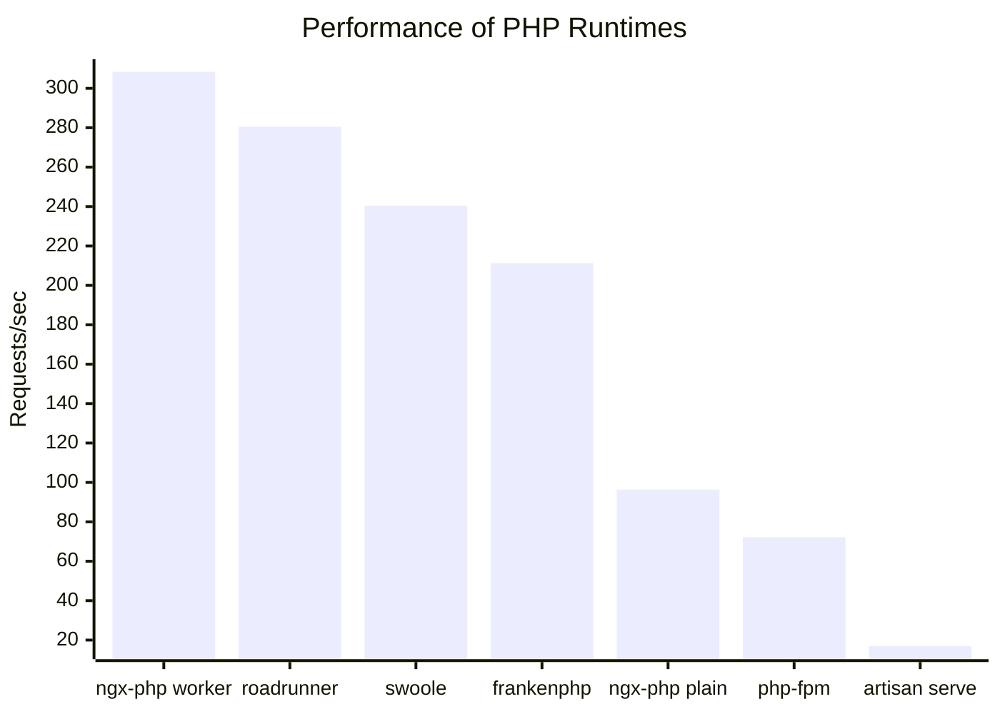

## Benchmark results:

| PHP Env              | Requests/sec |
|----------------------|--------------|
| ngx-php (worker)     | 308.35       |  
| roadrunner           | 280.51       |  
| swoole               | 240.43       |  
| frankenphp           | 211.28       |  
| php-fpm (opcache)    | 191.94       |  
| frankenphp (cgi)     | 112.95       |  
| ngx-php (plain)      | 96.34        |  
| php-fpm (no opcache) | 72.18        |  
| artisan serve        | 16.84        |  

The command I'm using to benchmark:
```shell
wrk -c 100 -t 4 -d 5 http://127.0.0.1:{port}
```


